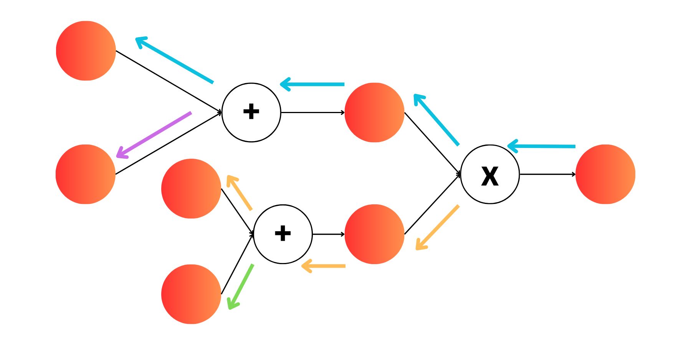
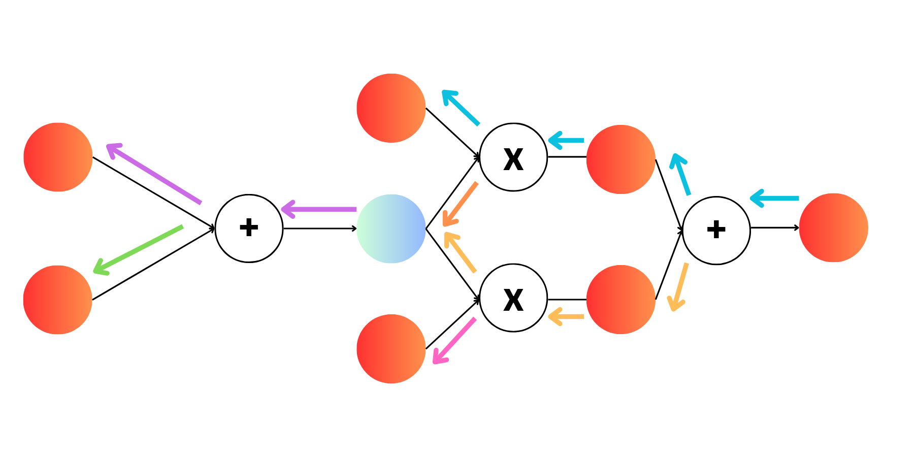

# MyTorch: AutoGrad

### Code Inspiration!
- To expand scalars to Matricies and Tensors, the [Autograd-from-Scratch](https://github.com/eduardoleao052/Autograd-from-scratch/tree/main) repository by [eduardoleao052](https://github.com/eduardoleao052) was extremely helpful and the main inspiration of the code. My code is has a small subset of the incredible features built into this package, but hopefully after walking through my implementation, the remaining will make more sense I hope!

In the previous section we implemented ManualGrad that definitely works but provides one inconvenience: For every forward function we define, we need to also explicitly define the backward function. This is completely unecessary though if we are able to define any complicated function as a composition of many functions. 

Typical computations are:
- adding
- subtracting
- multiplying
- dividing
- matrix multiplication
- exponentiating
- log
- averaging

With these limited computations, we can represent a large class of functions! Take Sigmoid again for example:

$$ sigmoid(x) = \frac{1}{1 + \exp(-x)} $$

But really, this is just a combination of exponentiation, sum and division! So as long as we know the derivative of the three sub-operations in sigmoid, we can use chain rule to get the overall derivative of the entire function! Lets write the composition of functions here:

$$a(x) = e^{-x}$$
$$b(x) = 1 + a(x)$$
$$\sigma(x) = \frac{1}{b(x)}$$

If you take the chain rule derivative of $\frac{d \sigma(x)}{d x}$ you will end up with the same formula as normal for the derivative of the Sigmoid function. 

### Computational Graph

The most important part of the AutoGrad system is building the computational graph to know the order of backpropagation. In [MicroGrad](https://github.com/karpathy/micrograd), Karpathy used something called [Topological Sort](https://www.geeksforgeeks.org/topological-sorting/) but I liked the method used by [Autograd-from-Scratch](https://github.com/eduardoleao052/Autograd-from-scratch/tree/main) where its almost like a Depth-First Gradient accumulation on the graph. Im not totally sure about the benefits of one or the other, but the idea here is, when we do an operation, we store the output as the child of each of the inputs. 

#### Example 1: Gradient Propagation 


Like in every neural network, we are propagating gradients from the end of the network back to the beginning. This is done recursively in the implementation! Lets start at the end and work back. 

The last operation we do is Multiplication and we need to propagate the gradients to the inputs of that operation. There are two paths here, going up the blue path and down the yellow path. Lets just say the top paths appears first in the recursion, it doesn't really matter you could also do bottom path first!

The gradients for the top path then propagate back again to the top Plus node, and again we propagate the gradient to the top-left most node (at the end of the blue path). Now that we are at the deepest part of the graph, we can then go back up a step again and complete the purple path. 
 
We then go all the way back up again and then go down the yellow path, again going all the way down always taking the top path, and then working our way back up completing the green path. By doing this we will recursively iterate through the entire graph!

This should remind you very closely of Depth-First Search 


### Example 2: Barriers to Gradient Propagation


Depth first search is not exactly correct though. Lets look at this example! Just like before we start at the end and work our way back. We will first propagate our gradient down the blue path just like before. Then we will once we get to the end of the blue path, we can move up a node and then update the light-blue node using the orange path. Now if we kept Depth First search going, we would continue propagating our gradients from the light-blue node **BUT THIS IS WRONG**. The light blue node has a dependencies from two separate branches. 

This is why we track our children of every node. Until a node has exhasted all its children (i.e. all the paths have come to it) we cannot continue onwards. The light-blue node in this case has 2 children. Doing the top path will exhaust one of them, but we must complete the second path as well to exhast the second child. Therefore we gate our Depth First Search so we dont continue to propagate past a node that hasn't been fully exhasted!

So now, we use the orange path to give our first gradient injection into the light-blue node and then work our way back up and then continue down the yellow path. Once the yellow path ends on the light-blue node, we can then propagate the gradient back again via the purple path and then green path for the final nodes. 

#### Tiny Caveat

I am most definitely not a computer scientist, so maybe some of the terminology I used is wrong. I am pretty sure this is what is happening, but if you have any better explanation please let me know!

### MyTorch Usage

Just as a very simply explanation of the code, the heart of the AutoGrad system is found in the ```Tensor``` class found in ```mytorch.tensor```. These tensors have all of the operations defined above along with their derivatives and ability to store the computational graph! The entire Tensor class is just a wrapper on top of standard numpy operations, we just manually track the gradients for backpropagation!

```python
import numpy as np
import mytorch

tensor = mytorch.Tensor(np.array([1,2,3]), requires_grad=True)
```


The use of this should be pretty similar to vanilla PyTorch to make it as familiar as possible!

```python
import mytorch
import mytorch.nn as nn
import mytorch.optim as optim

### We use regualar PyTorch Datasets,DataLoaders 
from torchvision.datasets import MNIST
from torch.utils.data import DataLoader

class MyTorchMNIST(nn.Module):

    def __init__(self):

        self.fc1 = nn.Linear(784, 128)
        self.fc2 = nn.Linear(128, 64)
        self.fc3 = nn.Linear(64, 32)
        self.fc4 = nn.Linear(32, 10)

        self.activation = nn.Sigmoid()

    def forward(self, x):

        x = self.activation(self.fc1(x))
        x = self.activation(self.fc2(x))
        x = self.activation(self.fc3(x))
        x = self.fc4(x)

        return x

model = MyTorchMNIST()
optimizer = optim.SGD(model.parameters(), lr=0.001)
loss_fn = nn.CrossEntropyLoss()

### Load Dataset ###
train_dataset = MNIST()

### Need DataLoader with Custom Collate Function to return our own Tensors ###
def collate_fn(batch):

    ### Prep and Scale Images ###
    images = np.concatenate([np.array(i[0]).reshape(1,784)for i in batch]) / 255

    ### One Hot Encode Label (MNIST only has 10 classes) ###
    labels = [i[1] for i in batch]
    labels = np.eye(10)[labels]
    
    images = mytorch.Tensor(images)
    labels = mytorch.Tensor(labels)

    return images, labels

loader = DataLoader(train_dataset, batch_size=4, collate_fn=collate_fn)

### Train Model ###
for _ in range(5):

    for images, labels in loader:
        ### Pass Through Model ###
        pred = model(images)
        
        ### Compute Loss ###
        loss = loss_fn(pred, ohe_labels)

        ### Update Model ###
        loss.backward()
        optimizer.step()
        optimizer.zero_grad()

        ...
```

### What about Other Functions?

What if we wanted to do $sin(x)$? In this case, this would have to be included as one of our operations in the tensor. We can only do autograd on operations that are a combination of the supported operations! Adding more operation is easy though! This is just to be the most minimal example possible. 

### What is this missing?

Compared to [Autograd-from-Scratch](https://github.com/eduardoleao052/Autograd-from-scratch/tree/main), there is actually quite a bit missing. The main things are:

- Slicing/Indexing (and their backward pass)
- Statistical calculations such as Variance (and the backward pass)
- A bunch of other stuff!!!

I tried to make this as compact as possible to make it as understandable as possible. As you will quickly see, adding in new operations is easy and just requires some thought of what that backward pass looks like!
