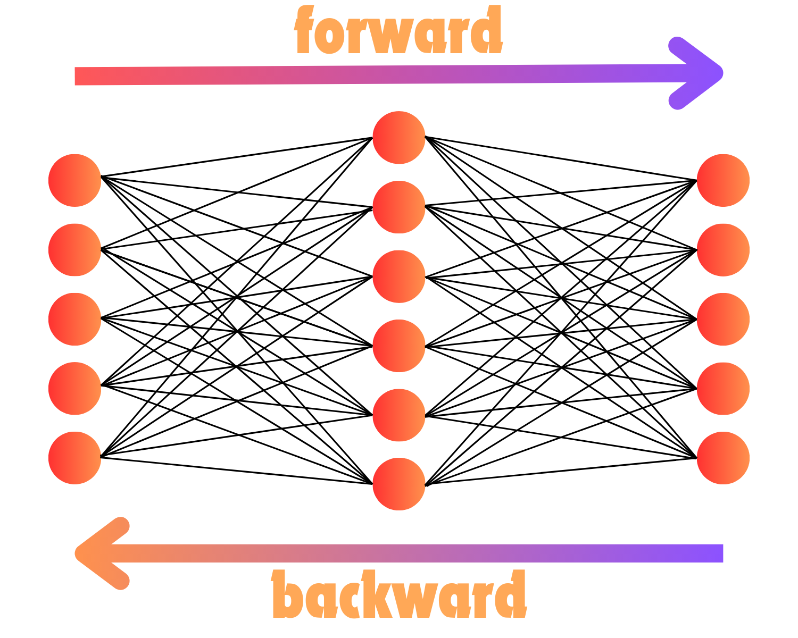

# The Magic of Neural Networks: Backpropagation

Its pretty crazy that complex and sophisticated systems like Neural Networks are trained with concepts we saw in high school! The entirety of the neural network depends squarely on chain rule to do its gradient updates. First of all, if you haven't already, take a look at the [3Blue1Brown Videos on Neural Networks](https://www.3blue1brown.com/topics/neural-networks). It will show you visually how the networks learn and its really quite incredible!

### Incredible Resources my code is Inspired By!
- The [MicroGrad](https://github.com/karpathy/micrograd) implementation from [Andrej Karpathy](https://github.com/karpathy) is the best way to see how neural networks can be implemented through operations on scalars (i.e. single numbers not matrix operations)
- To expand scalars to Matricies and Tensors, the [Autograd-from-Scratch](https://github.com/eduardoleao052/Autograd-from-scratch/tree/main) repository by [eduardoleao052](https://github.com/eduardoleao052) was extremely helpful and the main inspiration of the code. My code is has a small subset of the incredible features built into this package, but hopefully after walking through my implementation, the remaining will make sense!

## Motivation 

The purpose of this section, to implement neural networks from scratch, isn't to replicate PyTorch but rather give you an inside view into the way neural networks are trained. Neural Networks are just a bunch of multiplications, some unique activation operations and chain rule, but there is some more depth to this. Neural Networks in practice are actually a bunch of **TENSOR** multiplications with activations applied to **TENSORS** and then chain rule is also applied to **TENSORS**!! 

Unlike simpler scalar operations as seen in [MicroGrad](https://github.com/karpathy/micrograd), there are a few things that happen when our learnable parameters are tensors, and when our data is really batches of samples rather than a single sample at a time. There is also some consideration to be made for broadcasted operations. We will cover all this soon, but first we have to start with the basics!

## ManualGrad

I will call this section ManualGrad, because for every function we pass our data through, we must provide both the forward pass and the backward derivative. For this we will build a simple Neural Network of Linear layers and Sigmoid activation functions to fit a quadratic function. 
 
An example of Manually passing gradients is the following, lets say we want to pass our data through the sigmoid function: 

$$ \sigma(x) = \frac{1}{1 + \exp(-x)} $$

We also know that the [derivative of the sigmoid function](https://www.geeksforgeeks.org/derivative-of-the-sigmoid-function/) is as follows:

$$\frac{d \sigma(x)}{d x} = \sigma(x) (1 - \sigma(x)) $$

This means when we define our function, we need to specify our forward and backwards manually!

## AutoGrad

This is the magical part about PyTorch! Given an operation, it can manually compute the gradients for you, without ever specifying the backward function! But how is this? In ManualGrad we had to provide the derivative of the sigmoid activation function, but in AutoGrad we don't! This is because Autograd doesn't care about the overall function, but rather the sequence of computations that make it up. Typical computations are:
- adding
- subtracting
- multiplying
- dividing
- matrix multiplication
- exponentiating
- log
- averaging

With these limited computations, we can represent a large class of functions! Take Sigmoid again for example:

$$ sigmoid(x) = \frac{1}{1 + \exp(-x)} $$

But really, this is just a combination of exponentiation, sum and division! So as long as we know the derivative of the three sub-operations in sigmoid, we can use chain rule to get the overall derivative of the entire function! Lets write the composition of functions here:

$$a(x) = e^{-x}$$

$$b(x) = 1 + a(x)$$

$$\sigma(x) = \frac{1}{b(x)}$$

If you take the chain rule derivative of $\frac{d \sigma(x)}{d x}$ you will end up with the same formula as above! This is obviously the case as the derivation requires us to use chain rule to begin with, so I feel like im saying everything twice. The perk of AutoGrad though is, as long as we have the derivative of our sub-operations, then AutoGrad will automatically chain them together to compute the overall derivative of the function, without manually specifying as we did above!

#### Super Caveat!!

None of this is battle tested! I know it works for the cases I tried but I never did a thorough testing. Granted, if you need AutoGrad, just go use PyTorch! This is really just for learning only!