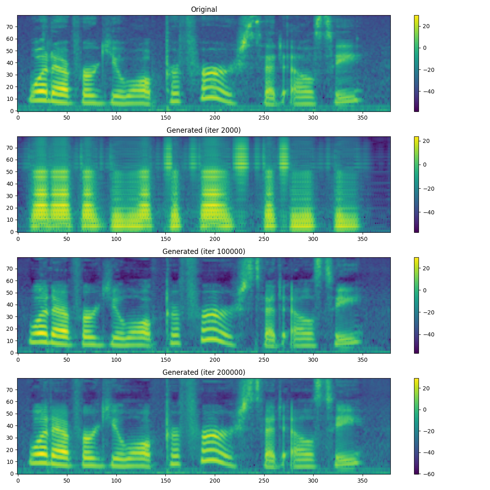
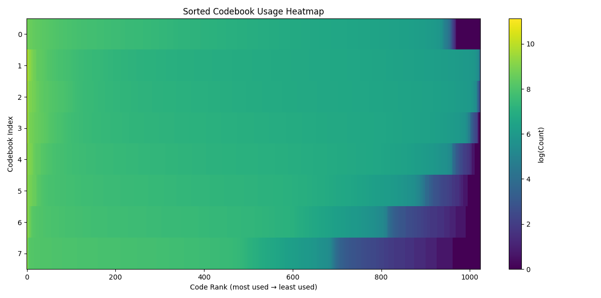
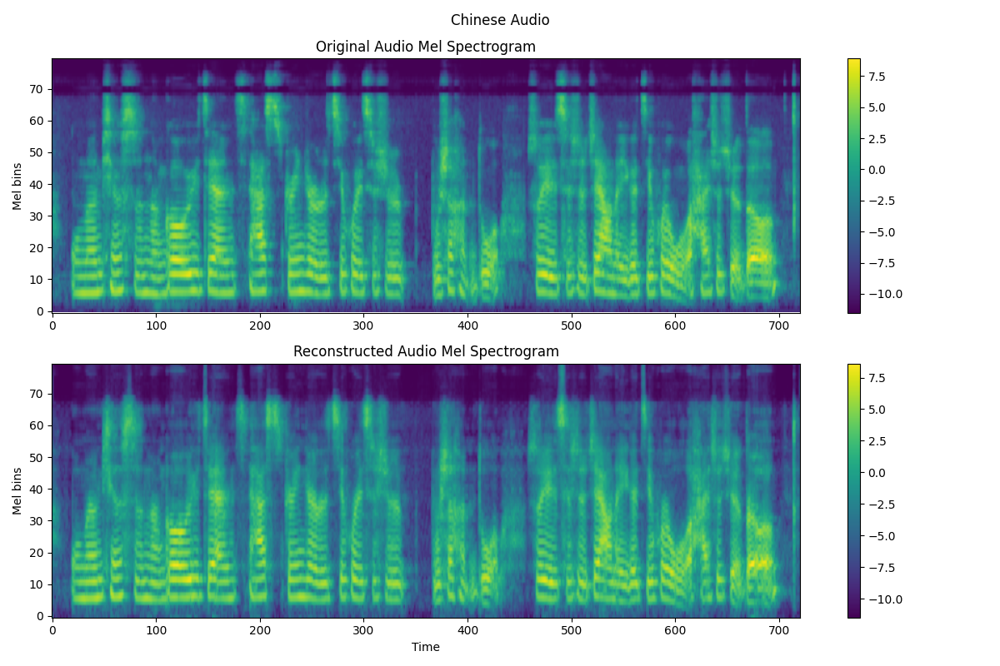
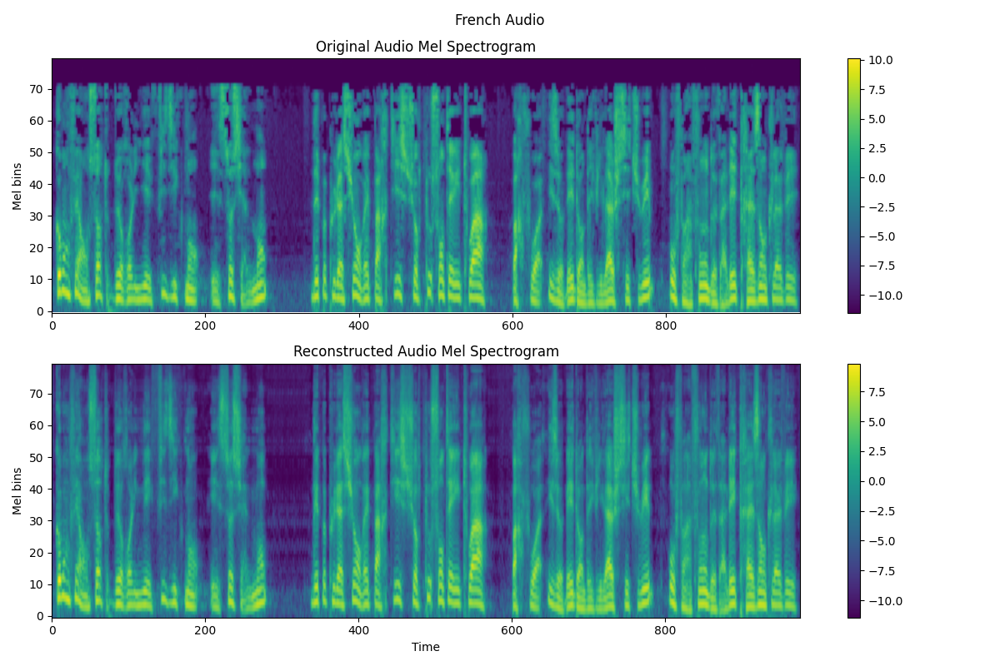
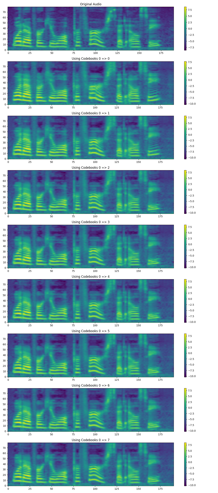

# EnCodec: Introduction to Speech Tokenization


## Text Tokenization is Easy!
Natural language is relatively easy to work with. Although many algorithms for text tokenization exists (Wordpiece, Bytepair Encoding, etc...), they all kind of do the same thing: map discrete symbols (words, characters, or subwords) into integer IDs drawn from a fixed vocabulary.

## Speech Tokenization is Not!
Speech however is fundamentally different. Unlike text, speech is not composed of a sequence of discrete symbols. It is a continuous and high dimensional waveform. 

At a typical sampling rate of 24kHz, you have 24,000 real valued floating point numbers per every second of audio. There is no predifined vocabulary, no natural segmentation into symbols, and no obvious way to assign discrete token IDs. 

If we want to apply modern sequence models like Transformers to speech in the same way we do text, we must first convert this continuous signal into a sequence of discrete tokens. 

## EnCodec

Many architectures exist today for this, but EnCodec is one of the first significant attempts. EnCodec is a neural audio codec that learns to compress speech down into a sequence of $N_q$ discrete tokens per timestep and then reconstruct the waveform from those tokens, just like an AutoEncoder! 

### Compression

The audio we will be working with (LibriTTS) is 24kHz. This means every second of audio has 24,000 floating point values! Our convolutional encoder/decoder will compress by a factor of 320, leaving us with only 75 samples per second. Each sample will be represented by 8 codes, where each code comes from one of 1024 different codes. 

This means each code has 10 bits of information because $log2(1024) = 10$. If we have 8 codes per step, then we have 80 bits of information per step. And if we have 75 steps, we have 6000 bits per second of data (or 6kbps) that we essentially compress to! Compare this to the original audio which is 24000 samples per second with 32 bits per sample, leaving us with 768 kbps!!

### Residual Vector Quantization

The main part of this architecture is the quantizer, and for most speech applications, Residual Vector Quantization works really well! This mainly comes down to the fact that speech has a nice structure of hierarchical information. You can imagine audio having high-level semantic information (speech content) and low-level acoustic details (timbre, prosody, etc..). Early VQs can capture those higher level features, while progressive deepder VQs capture the lower ones. 

EnCodec has upto 32 codebooks in its implementation as it is trained on a wide variety of audio types. Because we will mainly be focusing on Speech, most architectures today for that task typically use only 8 codebooks, each with 1024 codes

There are a few options to actually train the codebooks, as the indexing $argmin$ operation is non-differentiable:

1) **EMA updates w/ KMeans Initialization**: This approach trains the VQ codebook using EMA updates instead of gradient-based codebook losses. Initialization of the codes happen on the first input batch to the model using standard K-Means. For every subsequent batch we identify which samples are closest to which code and update the codebook vectors using exponential moving averages of the assigned encoder outputs. This was the method used by the EnCodec paper so thats what we will do!
2) **Codebook Loss**: Update the codebook vectors to move towards the encoder output with stop gradients. We implemented this in our [VQVAE tutorial](https://github.com/priyammaz/PyTorch-Adventures/blob/main/PyTorch%20for%20Generation/AutoEncoders/Intro%20to%20AutoEncoders/Vector_Quantized_Variational_AutoEncoders.ipynb). This was the architectural choice made in a different but similar architecture known as [Descript Audio Codec](https://arxiv.org/pdf/2306.06546) where they report better results than EnCodecs EMA Method
3) **Gumbel-Softmax**: Gumbel Softmax is a differentiable approximation to sampling from a cateogorical distribution, allowing gradients to flow through to the codebook directly. This is a popular choice in architectures like [Wav2Vec2](https://arxiv.org/abs/2006.11477) and you can explore our [implementation](https://github.com/priyammaz/PyTorch-Adventures/blob/main/PyTorch%20for%20Generation/AutoEncoders/Intro%20to%20AutoEncoders/gumbel_softmax_quantizer.ipynb) to learn more!

To stay true to the EnCodec paper we will stick to EMA updates in this case!

### Losses

As you can imagine there will be a variety of loss functions being used to train this!

1) **Time Domain Loss**: Simple MSE between the input and reconstruted audio
2) **Frequency Domain Loss**: MSE and L1 between the Mel spectrograms of the input and reconstructed audios. To additionally help with the uncertainty principle (time vs frequency resolutions), we compute this loss on a variety of spectrograms with different window sizes
3) **GAN Loss**: A discriminator looks at the real and imaginary components of spectrograms (with different window sizes) for real and generated audio. The loss function used is the Hinge loss. 
4) **Commitment Loss**: We want to ensure that the output of the encoder is close to the codes in the codebook. 

### Dynamic Loss Balancing

As you can imagine, making sure the effective gradient contribution from each of these losses can be hard to balance. So we use the proposed method from the EnCodec paper for dynamic loss balancing! 

The main idea is that we rescale the gradients from each of the losses to match the proportion of contributions we want. Normally when we scale losses we do the following:

$$L_{\text{total}} = \lambda_1 * L_1 + \lambda_2 * L_2 + \lambda_3 * L_3$$

The reason we multiply by scaling constants is we need to balance our scales of the loss values. For example, lets say the typical loss range for each of the losses are the following:

- $L_1$: 0.01 to 0.05
- $L_2$: 1 to 4
- $L_3$: 20 to 30 

Because $L_3$ has a larger overall magnitude, it will have a larger contributions to the gradient of the model, and similarly because $L_1$ has a smaller overal magnitude, it has a smaller contribution. This is typically not ideal, as the optimizer then overemphasizes $L_3$ and underemphasize $L_1$. We dont want the *importance* of a loss metric to be proportional to their magnitudes.

The standard trick for this is just multiply by a scaling constant. We can multiply $L_1$ by some $\lambda_1 >1$ to increase its magnitude, and similarly multiply $L_3$ $\lambda_3 < 1$ to reduce its magnitude. The issue here though is the actual ratio of gradient contributions isn't exactly interpretable. 

The key quote from the EnCodec paper is *We also find that the balancer makes it easier to reason about the
different loss weights, independently of their scale*. Three of the losses, Time Domain, Frequency Domain and GAN Loss, are all based on the output of the Decoder of EnCodec. This means during backpropagation we have to compute the gradient of each loss w.r.t that output of the DeCoder. What we can do is manually compute that gradient, see what the proportion of contribution is, and reweight it before continuing backprop!

More specifically:

We balance gradient contributions directly, rather than the loss values themselves. 

Let each loss be $\ell_i$, and let the model output be $\hat{x}$. Define the gradient of each loss with respect to the model output:

$$g_i = \frac{\partial \ell_i}{\partial \hat{x}}$$

Compute the exponential moving average of the gradient norm:

$$\langle \| g_i \|^2 \rangle_\beta$$

Then rescale each gradient as:

$$\tilde{g}_i =
R \frac{\lambda_i}{\sum_j \lambda_j} 
\cdot 
\frac{g_i}{\sqrt{\langle \| g_i \|^2 \rangle_\beta}}$$

The total gradient used for backpropagation becomes:

$$g_{\text{total}} = \sum_i \tilde{g}_i$$

instead of the usual

$$
g_{\text{total}} = \sum_i \lambda_i g_i
$$

In the end, the ratio of gradient contributions will be exactly the ratio of weights you provided!

## New Contributions

### Distributed Quantizer and Balancer w/ Accelerate

The tough part about this model is training in DDP mode, and a few things need to be considered. I like to use Huggingface Accelerate for all of my DDP training needs, so everything is using that!

The issue is the custom methods we wrote (EMA updates for the Quantizer and the Loss Balancer) need to pool data between all GPUs. For example, to update the codebooks, we have to find the average of all the vectors that are assigned to a cluster center. But if all the vectors are split between multple GPUs, then each computation PER GPU will end up different leading to divergence. Similarly when we balance the loss, it must be based on accumulated gradients ACROSS GPUS not just for each one. 

So we use Accelerate and do a bunch of broadcasting and reducing to make this all work out correctly! 

### Fused Snake Activation 

The standard activation function used in EnCodec is the **ELU** activation. More modern architectures are leveraging the [Snake Activation](https://arxiv.org/pdf/2006.08195) that injects a periodic bias to the data and this makes sense as audio typically has periodicity. The activation function is pretty simply on its own:

$$f(x) = x + \frac{\sin^2(ax)}{a}$$

And this is a pretty simply composite of operations, so we have a simple Triton kernel fusing the forward and backward pass for a roughly 7x throughput speed for this activation!

### Additional GANs

The standard EnCodec uses the **MultiScale STFT Discriminator**, which is an operation in the frequency domain. Other architectures, like HIFGAN do time domain discriminators such as the **MultiScale Discriminator** or **MultiPeriod Discriminator**. We do reduce the parameter count of these models though to make it balance better overall. 

## References

There were a ton of helpful resources I referenced to put this together!

- [EnCodec](https://github.com/facebookresearch/encodec) 
- [encodec-pytorch](https://github.com/ZhikangNiu/encodec-pytorch)
- [EnCodec_Trainer](https://github.com/Mikxox/EnCodec_Trainer)

## Lets Train a Model!

Training EnCodec is fairly simple! All you need is a bunch of Audio files. My testing was on the LibriTTS Clean split (about 500 hours of audio). 

### Build Dataset

First we have to build our dataset which is just a text file that has each line being the path to your audio. You can prepare this yourself, or just use the provided code that will search for all the audio files recursively for you:

```bash
python build_dataset.py <PATH_TO_ROOT> --split --train_ratio 0.95
```
This will automatically save two config files to ```data/train.txt``` and ```data/test.txt```. These files look like:

```txt
LibriTTS/train-clean-360/3549/173591/3549_173591_000004_000000.wav
LibriTTS/train-clean-100/3830/12535/3830_12535_000021_000000.wav
LibriTTS/train-clean-360/6406/88089/6406_88089_000010_000000.wav
...
```

### Setup Config

You will find a config file in ```configs/config.yaml```. There are a bunch of stuff you can change in there, but the main ones are the following:

```yaml
training_config:

  experiment_name: EnCodecTrainerLibriTTS         # Experiment Name for WandB and Logging
  run_name: null                                  # Run name specifically for WandB
  working_directory: "work_dir"                   # Where to store checkpoints, results, etc...
  path_to_train_manifest: data/train.txt          # Path to training files list
  path_to_test_manifest: data/test.txt            # Path to testing files list
  total_iterations: 250000                        # How long do you want to train?
  per_gpu_batch_size: 12                          # Whatever fits!

generator_config:
  num_quantizers: 8                               # How many quantizers in your RVQ?
  codebook_size: 1024                             # How many codes PER quantizer?

discriminator_config:
  use_multiscale_freq_discrim: True               # This is the default for EnCodec
  use_multiscale_time_discrim: False              # Multiscale from Hifigan
  use_multiperiod_time_discrim: False             # Multiperiod from Hifigan
```

### Train Model 

All our stuff is ready we can just train and wait now!

```bash
accelerate launch run.py
```

### What is created during Training?

As you train a few things will happen.

1) Some samples from the testset will be inferenced in intervals so you can hear how your model is improving with more training!
2) Checkpoints will be saved. If you want to resume training simple change ```trainer.train()``` to ```trainer.train(resume=True)``` in ```run.py```

The interval at which these happen can be adjusted in the the config!

## Inference

Now that we have a model, we can tokenize our audio!

```python
### Load Model ###
config = load_yaml()
encodec_config = EnCodecConfig(**config)
model = EncodecModel(encodec_config)
state_dict = torch.load(PATH_TO_WEIGHTS)
model.load_state_dict(state_dict)   

### Load Some Audio
audio = load_audio()

tokens, _ = model.tokenize(audio)
print(tokens) # [num_codebooks x 1 x timesteps]
```

## Results

### Spectrograms
First lets take a look at the mel spectrograms. I grabbed a few from the training run and just plotted the spectrogram of one of audio files original vs generations.



It is pretty clear that as the model trains its ability to reproduce the spectrogram improves! Even more cool is this audio was noisy (you can see this in the higher frequencies of the original) but EnCodec ends up denoising it a bit!

### Codebook Utiliation

The most important part of our model is the RVQ. In our default setup we have allowed for upto 8 codebooks with 1024 codes per book. But how many of them are actually being used? This is typically known as index collapse when only a small number of codebooks are being used and the rest are dead. We did help with this, as in our script we replaced dead codes with new ones, but lets see the results!



As you can see, this is not too bad! Codebooks 1, 2, and 3 are basically fully utilized, and codebook 0 (our first codebook) is almost fully utilized. But we see progressively worse utilization afterwards. There are a couple of good reasons we can give for this though:

- **Not enough data diversity**: I simply trained on the clean split of LibriTTS. But we had a larger dataset with more languages, that could have increased complexity and forced greater usage. Or if we had a dataset of other types of audio like music that could also increase the complexity 
- **Limitation of EMA**: [Descript Audio Codec](https://arxiv.org/pdf/2306.06546) finds better codebook utilization by using a commitment loss rather than EMA updates. 
- **No Diversity/Perplexity Loss**: One trick that Wav2Vec2 uses is to include a diversity loss penalty that incentivizes the model to increase codebook utilization. 

### Out of Domain

This model was trained on English only, what if we pass in french or chinese?




Not bad! If you look in ```ood_samples``` and download the audios then you will hear that the French reconstruction is pretty good. Chinese is just ok, but Chinese and English are very different so this makes sense as its very out of distirbution!

### How many Codebooks?

The hypothesis behind RVQ is that early codebooks learn semantic information and later layers learn more acoustic information. So what happens if we only inference with a few of the codebooks?



You can see that progressively we are adding in additional information!

### Next Steps?

This actually sets the stage for something more important. The main purpose of a Codec system like this is exactly as it sounds: Codecs compress and decompress. This way when we transmit data, we only have to transmit a few integer indexes rather than thousands of floating point audio samples. 

But we also just have code indexes that represent the audio? Why not train an LLM? That is exactly what we will do, to generate audio with LLMs using these code indexes!! This gives us a new class of models called SpeechLLMs