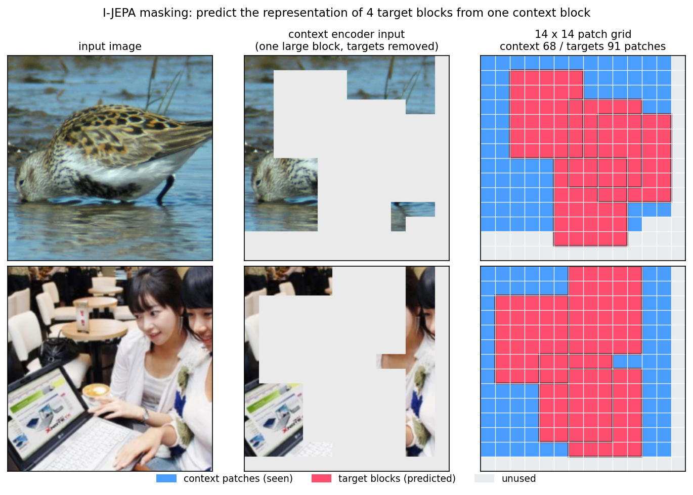
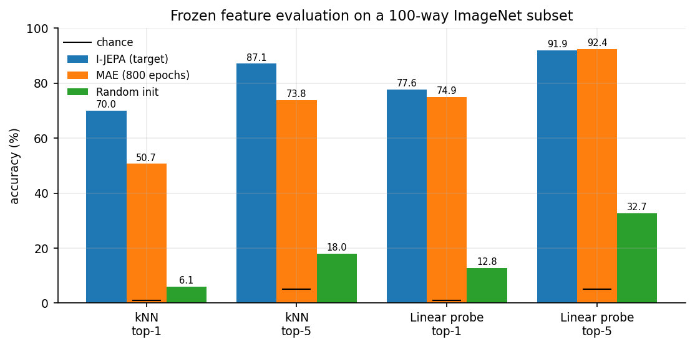
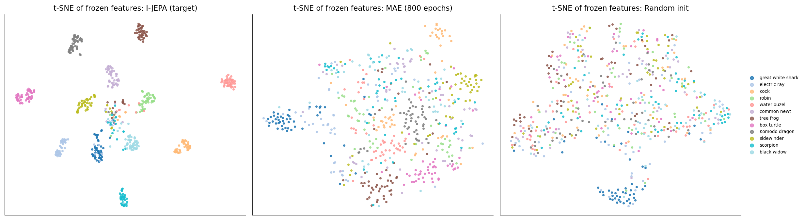
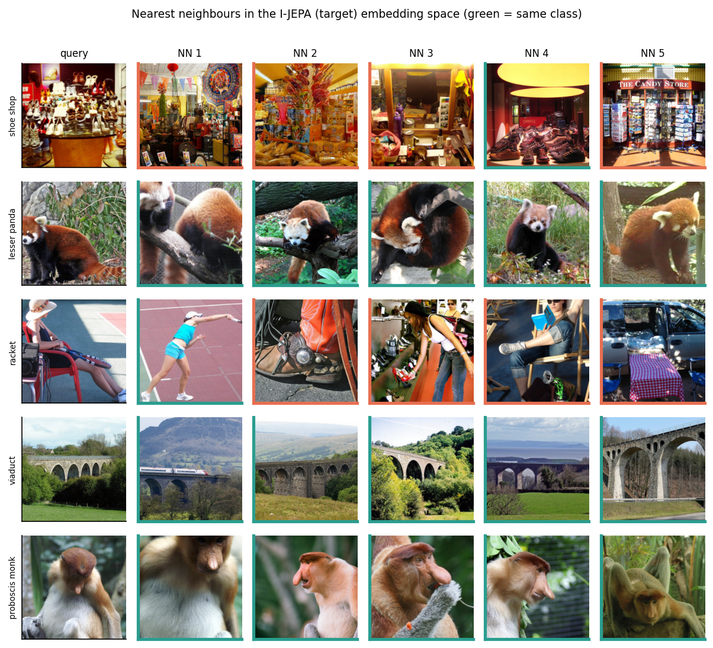

# Self-Supervised Learning by Predicting Representations (I-JEPA)

=

Our [Masked AutoEncoder](../Masked%20AutoEncoder) learned by hiding 75% of the image patches and reconstructing the missing **pixels**. Although it works, consider the actual objective: to minimize the reconstruction loss, the model has to remember the exact texture of grass, the precise shade of blue in the sky, etc... None of that is actually important to the content of the object, which is what we want the representation to be about. 

[I-JEPA](https://arxiv.org/abs/2301.08243) (Image-based Joint Embedding Predictive Architecture) keeps the masked prediction idea, but moves the prediction out of the pixel space and into the **representation space**. We never reconstruct anything, instead a *predictor* is asked to guess what another copy of the encoder would produce for the patches we hid. If some detail is unpredictable noise, the model is free to throw it away, because there is again to reconstruction error. 

## Model Structure

Three modules, all defined in [`model.py`](model.py):

| Module | Trained how | What it does |
| ------ | ----------- | ------------ |
| `context_encoder` | gradient descent | ViT-B/16 that sees **only** the context patches |
| `target_encoder` | EMA of the context encoder, no gradients | ViT-B/16 that sees the **full** image, provides the prediction targets |
| `predictor` | gradient descent | narrow ViT (384 dim, 6 blocks) that maps context tokens + target *positions* to predicted target representations |

A single training step looks like this:

1. Sample the masks ([`masking.py`](masking.py)): one big **context** block and 4 smaller **target** blocks.
2. The context encoder embeds only the context patches. There is no mask token, the target patches are simply not in the sequence.
3. The target encoder embeds the **entire** image, and we index out the tokens at the target positions. This happens under `torch.no_grad()`, the target encoder is never backpropagated through.
4. The predictor takes the context tokens, plus one learnable mask token per target position (each carrying its own positional embedding), and predicts the target representations.
5. Smooth L1 loss between prediction and target, and the target encoder is nudged toward the context encoder with an EMA update.

## Masking Strategy

Following Appendix A.1 of the paper, `IJEPAMaskSampler` samples:

- **4 target blocks**, each covering 15-20% of the 14x14 patch grid with an aspect ratio between 0.75 and 1.5
- **1 context block** covering 85-100% of the grid, with every target patch **removed** from it

That removal is the important part. If the context block were allowed to contain the target patches, the predictor's job would be copying rather than inferring. You can see a few sampled masks (the figure at the top of this README) by running:

```sh
python masking.py
```

Different samples in a batch end up with slightly different numbers of patches, and rather than padding, the original implementation truncates every sample to the smallest count in the batch. We do the same, which is why `sample()` returns nice rectangular `(B, Nc)` and `(B, npred, Nt)` tensors.

## Why Doesn't This Collapse?

This is the main challenge for architectures like this. Nothing in the loss says "produce different representations for different images", so what stops the encoder from mapping everything to a single constant vector and the predictor from learning to output that same constant? The loss would be zero and we would have learned nothing.

Three things work together:

**1) We align *predictively*, not *directly*.** Consider the two options:

| | Objective | What happens |
| - | --------- | ------------ |
| A | Direct alignment, `Zc ≈ Zt` | The context representation is forced to directly match information it cannot observe. The easiest way out is for both encoders to agree on a trivial shared representation, which is collapse |
| B | Predictive alignment, `g(Zc) ≈ Zt` | The context only has to encode what is *useful for prediction*. The predictor `g` does the work of transforming context features into target representations, so `Zc` and `Zt` are allowed to be different |

I-JEPA does B. The predictor is the buffer that lets the two representation spaces stay distinct.

**2) The two encoders see different things.** The context encoder computes representations **only on the visible patches**, while the target encoder computes representations over the **entire image** and then indexes out the selected positions. So the context branch has to infer information it never saw: given this context and this position, *what is there?* That asymmetry is what helps avoid representation collapse. 

**3) The target encoder is a slow moving teacher**, exactly like [BYOL](https://arxiv.org/abs/2006.07733) and [DINO](https://arxiv.org/abs/2104.14294). It is an exponential moving average of the context encoder (momentum annealed from 0.996 to 1.0 over training), so if the context encoder starts drifting toward a degenerate solution, the targets do not immediately follow it there. The targets keep pointing at the older, non-degenerate representation, and the loss pulls the context encoder back.

## PreTraining I-JEPA

### Downloading ImageNet

[Here](https://gist.githubusercontent.com/antoinebrl/7d00d5cb6c95ef194c737392ef7e476a/raw/74a1246c9254676e19c106ae67e57c9a174ff5de/prepare.sh) is a convenient script that takes the `ILSVRC2012_img_train.tar` and `ILSVRC2012_img_val.tar` files you download from the [official ImageNet website](https://image-net.org/download.php) and lays them out as `train/` and `validation/` folders. Just keep track of where you saved it.

### Setup Training Environment

Verify that you have [Accelerate](https://huggingface.co/docs/accelerate/en/index) installed and run `accelerate config` to tell it about your machine, then `accelerate test` to verify. Create a working directory for the checkpoints, and you are good to go.

### Resources Used

All pretraining was done on a 4 x GH200 node.

### Pretrain on ImageNet-1K

```sh
accelerate launch pretrain.py \
    --experiment_name       "ijepa_vitb" \
    --wandb_run_name        "ijepa_vitb_pretraining" \
    --path_to_data          "<PATH_TO_IMAGENET_ROOT>" \
    --working_directory     "<PATH_TO_WORK_DIR>" \
    --epochs                300 \
    --warmup_epochs         15 \
    --per_gpu_batch_size    512 \
    --num_workers           16 \
    --log_wandb
```

One thing to notice is we also linearly *increased* weight decay from 0.04 to 0.4. This tightens regularization as the representation forms. Early in training, weaker weight decay allows the model to freely learn useful features, while stronger decay later discourages the representation from becoming overly specialized of relying on unnecessarily large weights.

The results for pretraining can be seen [here](https://api.wandb.ai/links/exploratorydataadventure/ykbxuyg9).

## Did it Actually Learn Anything?

The pretraining loss going down proves nothing on its own unfortunately (as if it collapses then it will also go down), so we have to probe the model to see if it learned anything meaningful

I sample 100 random ImageNet classes, 100 train images per class as a labelled bank (10,000 images), all 50 validation images per class held out (5,000 images), features are the **mean pooled patch tokens** of the target encoder. Two probes on top of that:

- **kNN**, which fits no parameters at all and just asks whether semantically similar images landed near each other (exploration of the latent space itself)
- **Linear probe**, a single linear layer on the frozen features (predictability of the latent space)

Every number is measured against a **randomly initialized encoder of identical architecture**, as well as the Masked AutoEncoder. 



| Model | kNN top-1 | kNN top-5 | Linear top-1 | Linear top-5 |
| ----- | --------- | --------- | ------------ | ------------ |
| I-JEPA (300 epochs) | **69.98%** | **87.06%** | **77.74%** | 91.86% |
| MAE (800 epochs) | 50.66% | 73.82% | 74.80% | **92.62%** |
| Random init | 5.92% | 17.62% | 12.68% | 32.40% |
| Chance | 1.00% | 5.00% | 1.00% | 5.00% |

We can also plot the TSNE for the pooled representations to see how clustered the latent representations are.



Lastly we can check retrieval, how well can we identify images of a specific class using a nearest neighbor search?



## I-JEPA vs MAE

Since both models in this repo are ViT-B/16 pretrained on ImageNet-1K without labels, we can put them side by side. The only real difference is *what each one is asked to predict*:

| | I-JEPA | MAE |
| - | ------ | --- |
| Prediction target | **representations** from an EMA target encoder | **pixels** |
| Masking | 4 target blocks predicted from 1 context block | 75% of patches dropped at random |
| Second network | narrow predictor, conditioned on target positions | decoder that reconstructs the image |
| Encoder input | context patches only | the visible 25% of patches |
| Anti-collapse mechanism | predictor asymmetry + EMA teacher | not needed, pixels are a fixed target |

The gap between the two models is especially interesting. On kNN, where we depend on the geometry of the latent space, I-JEPA is ahead by 19 points, despite only being trained for 300 epochs compared to the MAE's 800 epochs. On the other hand, given a shallow linear predictor, the gap shrinks to 3 points. 

This pattern is the main argument for predicting in the representation space. MAE's features carry plenty of class information, but is tangled up in the low level detail the reconstruction is forced to keep, so a linear layer can pull it out while a distance metric in raw feature space cannot. 

## Wrap-Up

The takeaway is that the *representation* of the prediction target matters as much as the masking. Reconstructing pixels forces a model to model everything, including the parts we would rather it ignored. Predicting representations, with a predictor and a slow moving teacher to keep it honest, gives us an encoder whose embedding space is already organised by semantics before it has ever seen a label.
