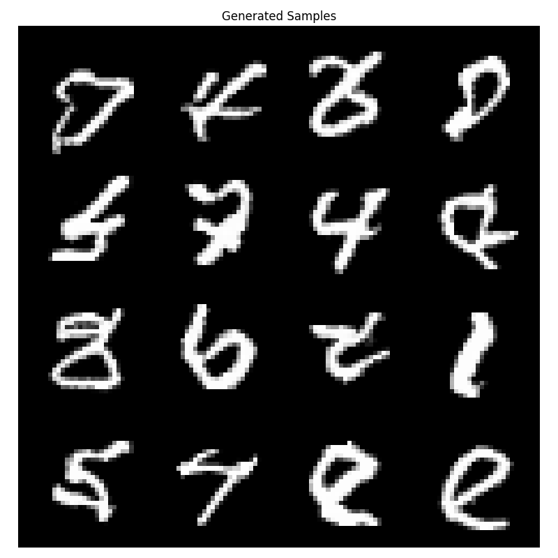

# PixelCNN


PixelCNN is a type of autoregressive deep generative model designed for images. It models the joint distribution of pixel values by factorizing it into a sequence of conditional probabilities, predicting each pixel based on previously generated pixels. Using masked convolutional layers, PixelCNN ensures that the prediction for a given pixel only depends on pixels above and to the left, preserving the correct ordering. This allows it to generate images one pixel at a time, producing high-quality and coherent samples.

### Usage

To train the model simply run:

```bash
python train.py \
    --dataset mnist \
    --batch_size 32 \
    --epochs 100 \
    --lr "0.00025" \
    --device cuda:0 \
    --checkpoint_dir work_dir/mnist_chkpts \
    --gens_dir work_dir/mnist_gens \
    --bf16
```

### Generations

Here is a sample generation!



Although not a powerful generative model in this form, it is cool that it even works to begin with!
